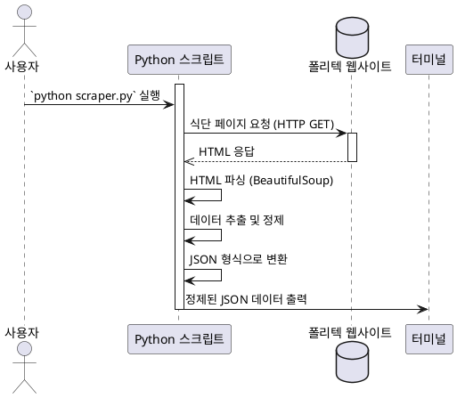

# 한국폴리텍대학 정수캠퍼스 식단 크롤러

이 프로젝트는 한국폴리텍대학 정수캠퍼스의 주간 식단표를 웹 크롤링하여 JSON 형태로 출력하는 파이썬 스크립트입니다. Docker를 사용하여 격리된 환경에서 실행되도록 구성되어 있습니다.

---

## 1. 프로그램 설명

스크립트는 지정된 URL에서 식단 정보가 담긴 HTML 페이지를 가져와 `BeautifulSoup` 라이브러리로 파싱합니다. 그 후 주간 식단표 테이블에서 날짜, 조식, 중식, 석식 메뉴를 추출하여 불필요한 문자를 제거하고, 최종적으로 구조화된 JSON 형식으로 터미널에 출력합니다.

### 크롤링 과정 (시퀀스 다이어그램)


https://img.plantuml.biz/plantuml/png/VLHBYnD14Bu7yX_AkJY3sTbr5PJ0g0HMnSUk9X4FkeJUcKvst4vtsmzM4K71WoyGBxhAgWXxyE11H4J1NsGc_y7gdedPPCKSadJLLrzLVLNTPxGXojWXgzTCRXY5ujcxqRDFC7xuUVHnR_JXSwXJHIHLiRmRmUZ5c-BzIyJiZXyyA9xkrMlr6acDKD2sd5C5H4ExNfD8cQUv9Dn0q4bLBatWN9qvbwAtBTL6UsTxvUgSUqj84PCqtb9GFDeTVNtaSTTNMdEu5YNMv7tBEi9AZsdDPxgb1VUU2vsrrJcVDfcmPO5hrxgkfJOid89E4_lS6xzwKgzrt1dhQyA0cj0gbWIRnaZTN5pStjwEftKkth9yeErYAhYXtCIPE3sat2RBnqy44VAkN7LCs44JpdUxL-3SIXV-4rEl8HGM9icNbvPWxI8SmTZBbogsij0srL9mJKD5TUGww5GTu3ccF1LPpWUGG61DV-5aKFbR29ZHpeN7Xjun3S06Xon6dJHLhlHMPv9B8t1_2aCsS6qIRu_xES_2m9k21jmBKaQq3feGc0tMAv6kkU1-jAz6iQqntdid11iYknj4_jGZZA75Lr6lCI4az77XA4atNIZat3FKQm0JnbGmnuZc_GoPOm0Wp02ZF7IW2984ZZlhD3WZXlQS2CZWC3UMrcCSkpU5sk0o9rrbQHHhoN8J1ZTlyY12KCaoK2W3f8mItdETXYQBOBppe_Y-2yV6Rv-Ng6cs3KN9LfzedsqQvHCVNO_cuSnoRFiWTFaW54VkRkH1xB5rhsI9vi9GKFbWqu3ekmiArMUsXURKiG2LE2Rxfox_Gk9FhAXa9AMbOBXWmGmoDtIe9z1AMGJDO1GrLl4AclUhFuSIk77uy3fGfYci2aud8PHdlhtoZAVPERlMUZXi4XCfqHlUSvDlJ2VIADLkL4hUzxNuB67n-Xly_h9RFDw1qVV7nRjVnS-TQ9PUR-NI1xYy_glQUFS2uNJiKEhmRmqDn6chQ8_eDC-JimJJD72rCtmHacMaTb6J6-WUinugNX7YezK4gN9kmed73_WCPiM7_Gy0

---

## 2. 사전 준비 (Prerequisites)

이 프로젝트를 실행하기 위해서는 아래의 프로그램들이 설치되어 있어야 합니다.

* **Git**: 소스 코드를 내려받기 위해 필요합니다.
* **Docker Desktop**: 컨테이너를 생성하고 실행하기 위해 필요합니다. (Windows 사용자는 WSL2 백엔드 사용 권장)
* **Visual Studio Code**: 코드 편집 및 개발 환경 접속을 위한 에디터입니다.
* **[Dev Containers](https://marketplace.visualstudio.com/items?itemName=ms-vscode-remote.remote-containers) 확장 프로그램**: VS Code 내에서 Docker 컨테이너에 쉽게 연결하기 위해 필요합니다. (VS Code 확장 프로그램 탭에서 `ms-vscode-remote.remote-containers` 검색 및 설치)

---

## 3. 실행 방법 (Execution Guide)

프로젝트를 클론한 후, 두 가지 방법으로 스크립트를 실행할 수 있습니다.

### 3.1. VS Code를 이용한 실행 (권장)

가장 간편하고 강력한 방법으로, 코드 수정과 실행을 실시간으로 할 수 있습니다.

1.  **프로젝트 클론**: 원하는 위치에서 터미널을 열고 아래 명령어를 실행합니다.
    ```bash
    git clone <저장소_URL>
    ```

2.  **VS Code에서 폴더 열기**: VS Code를 실행하고 `File > Open Folder...` 메뉴를 통해 방금 클론한 프로젝트 폴더를 엽니다.

3.  **컨테이너에서 다시 열기**: VS Code가 `.devcontainer` 폴더를 인식하고 오른쪽 하단에 **"Reopen in Container"** 알림을 표시합니다. 이 버튼을 클릭합니다. (최초 실행 시 이미지를 빌드하므로 시간이 다소 소요될 수 있습니다.)
    
4.  **스크립트 실행**: 컨테이너 환경이 준비되면, VS Code 터미널(`Ctrl` + ` \` `)을 열고 아래 명령어를 입력합니다.
    ```bash
    python scraper.py
    ```

### 3.2. 터미널(PowerShell, CMD)을 이용한 실행

VS Code 없이 Docker 명령어를 직접 사용하여 일회성으로 스크립트를 실행할 수 있습니다.

1.  **프로젝트 클론 및 이동**:
    ```bash
    git clone <저장소_URL>
    cd <프로젝트_폴더명>
    ```

2.  **Docker 이미지 빌드**: 프로젝트 폴더 내에서 아래 명령어를 실행하여 `Dockerfile`을 기반으로 이미지를 생성합니다.
    ```bash
    # 'kopo-menu-scraper'라는 이름으로 이미지를 빌드합니다.
    docker build -t kopo-menu-scraper .
    ```

3.  **Docker 컨테이너 실행**: 빌드된 이미지를 사용하여 컨테이너를 실행합니다. 스크립트가 실행되고 결과가 터미널에 출력된 후 컨테이너는 자동으로 삭제됩니다.
    ```bash
    # '--rm' 옵션은 실행이 끝나면 컨테이너를 자동으로 삭제해줍니다.
    docker run --rm kopo-menu-scraper
    ```
